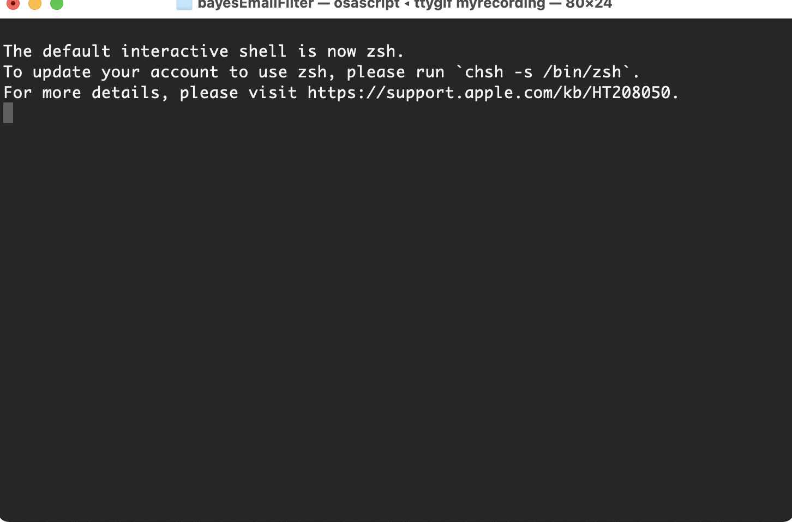

# bayesEmailFilter
This is an Artificial Intelligence academic project for what its main requirement was to create an email spam filter based on the Naive Bayes algorithm.  

## Usage

## Project Needs/Requirements

1. Shall use Python.
2. Shall use the Naive Bayes for email classification.
3. Shall use the sms.csv file as the project emails data base or other public available repositories data.
4. Shall use a training, test and validation collection 70/15/15.
5. Can, eventually, submit the documents trough a pre-processing process to remove not relevant content like not informative characters or strings.
6. Shall create a way of displaying the filter KPIS. (TODO)